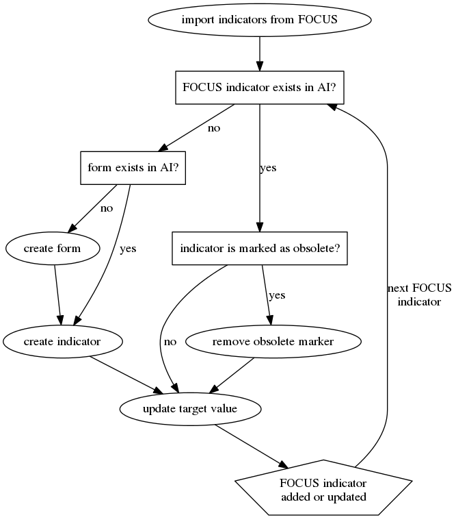
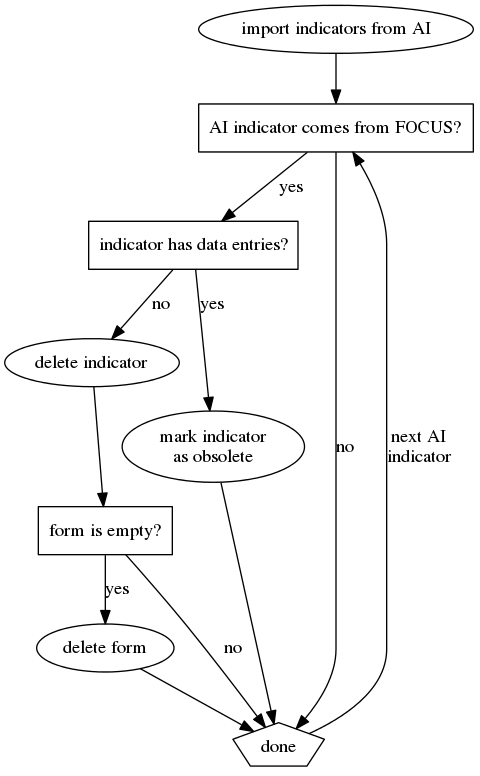

UNHCR Response Monitoring
==================================

R scrips and data to create databases for UNHCR Geneva based on indicators that 
are extracted from their *Focus* system.

## Prerequisites

The R scripts require the
[ActivityInfo R package](https://github.com/bedatadriven/activityinfo-R)
to be installed in R.

The *rjson* (available from CRAN) package is required to read JSON data from a 
URL or a local file.

## Usage

Use the `create_db.R` script to create a database or `update_db.R` to update an 
existing database in ActivityInfo. These files contain settings to be modified 
by the user. There is a second file, `functions.R` which contains a number of 
functions which are used by `workflow.R`, the main script that performs the 
actual work.

To **create a new database**, set a country (see the 
[ISO-3166-1 alpha 2](http://en.wikipedia.org/wiki/ISO_3166-1_alpha-2)
standard for the two-letter country codes) in `create_db.R`, for example, 

    country.code <- "SY"

which is the country code for Pakistan. Provide a name and (optionally) a 
description for the database. For example:

    database.name <- "UNHCR Response Monitoring"
    database.description <- "a longer description of the database"
    
To **update an existing database**, provide only the database identifier in
`update_db.R`:

    database.id <- 1234
    
This identifier can be found in the URL when you double-click on the database in
the *Design* tab. For this example it would look like
`https://www.activityinfo.org/#db/1234`.

In both of the above cases, you must also provide a target name. Target values
are grouped per target set in ActivityInfo and each set has a name and, 
optionally, a few other pieces of information such as a date range. For example:

    target.properties <- list(
      name = "zzz_OL",
      fromDate = "2014-01-01",
      toDate = "2014-12-31")

When you create a database, this information is used to create a set of target
values named *zzz_OL*. When you update a database this information determines 
which set of target values gets updated.

## Indicator types

We distinguish four types of indicators:

1. output indicators, also called performance indicators, which track
activities and other non-monetary metrics;
2. budget indicators which are used to track budget spending;
3. impact indicators, many of which are calculated, which track the impact of
an operation on its objectives;
4. attributes (not to be confused with site _attributes_ in ActivityInfo) are
lower-level indicators which provide input to the impact indicators.

## Input

Input data from FOCUS can be provided in one of two ways:

1. as CSV or JSON files on the local file system or
2. as a URL that points to a FOCUS API end point.

Note that it is not possible to load (calculated) impact indicators and their
*attributes* from CSV.

### CSV files

The input is provided by two files in the `data` folder:

1. `1_Form_Output-Indicator-Target.csv`
2. `3_Form_Output-$-Target.csv`

Both of these files must have the following columns:

- *Objective* and *Output* which are concatenated into a form name (forms are 
  also known as activies in ActivityInfo),
- *PPG* and *Goal* which are concatenated into a form category,
- *Indicator* which contains the indicator name,
- *Target* which contains the numeric target values; missing values (i.e. no
  target defined) should be represented by an empty field,
- *MSRP PPG ID*, *MSRP Goal ID* and *ID* which are concatenated into a character
  string that is used a unique identifier for each indicator.
  
When creating a new database, a file `4_Partners.csv` including the list of 
partners must also be present.

In both `create_db.R` and `update_db.R` these files are set in a list called 
`input`, like in the following example:

    input <- list(
      partners = file.path("data", "4_Partner.csv"),
      output.indicators = file.path("data", "1_Form_Output-Indicator-Target.csv"),
      budget.indicators = file.path("data", "3_Form_Output-$-Target.csv")
    )
  
### JSON files or API

Local JSON files or JSON retrieved from an API must contain certain fields
depending on which type of indicator is provided by the JSON. The following
table gives an overview of which fields are required for the different
indicator types:

Field           |  output  |  budget  |  impact  |  attributes
--------------- | -------- | -------- | -------- | ------------
OBJECTIVE       |  ×       |  ×       |  ×       |
OUTPUT          |  ×       |  ×       |          |
OUTPUT_MSRP_ID  |          |  ×       |          |
PPG_NAME        |  ×       |  ×       |  ×       |
PPG_CODE        |  ×       |  ×       |  ×       |
GOAL            |  ×       |  ×       |  ×       |
GOAL_MSRP_ID    |  ×       |  ×       |  ×       |
INDICATOR       |  ×       |          |  ×       |
INDICATOR_ID    |  ×       |          |  ×       |  ×
IMP_TARGET      |  ×       |          |  ×       |
OL_BUDGET_OPS   |          |  ×       |          |
ATTRIBUTE       |          |          |          |  ×
ATTRIBUTE_ID    |          |          |          |  ×
FORMULA         |          |          |          |  ×
VARIABLE_NAME   |          |          |          |  ×

Table: required fields in the JSON for the four different types of input files.

Here is how some of these fields are used:

* The *OBJECTIVE* and *OUTPUT* fields are concatenated to create a form name,
except for impact indicators which are only distinguished at the objective
level. Impact indicators and their attributes are stored in a form named after
only the *OBJECTIVE* field. Attributes are indicators which are used to
calculate an impact indicator, therefore these are always linked to an impact
indicator and thus end up in a form named after the objective of the impact
indicator. The *INDICATOR_ID* field is used to match attributes with their
(impact) indicator.
* The *PPG_NAME* and *GOAL* fields are concatened to create the category to
which a form belongs, also for the impact indicators.
* The *IMP_TARGET* field provides a (numeric) target value for the output and
impact indicators whereas *OL_BUDGET_OPS* provides the target value for budget
indicators. Attributes do not have target values.
* For all indicators except the attributes a unique identifier is created using
the *PPG_CODE*, *GOAL_MSRP_ID* and either the *INDICATOR_ID* or
*OUTPUT_MSRP_ID* fields, the latter being used only in the case of an output
indicator. See also the section **Name in expression** below).

The file with partners should have the fields *PARTNER_SHORTNAME* and 
*PARTNER_NAME*.

Like for CSV files, the input should be provided as

    input <- list(
      partners = file.path("data", "4_Partner.json"),
      output.indicators = file.path("data", "1_Form_Output-Indicator-Target.json"),
      budget.indicators = file.path("data", "3_Form_Output-$-Target.json"),
      impact.indicators = file.path("data", "2_Form_Impact-Indicator-Target.json"),
      attributes = file.path("data", "Attributes.json")
    )
    
or using an API:

    input <- list(
      partners = "http://partner/url",
      output.indicators = "http://output/indicator/url",
      budget.indicators = "http://budget/indicator/url",
      impact.indicators = "http"//impact/indicator/url",
      attributes = "http://attributes/url"
    )

## Details

### Name in expression

ActivityInfo has the option to provide an alternative name (or *code*) for each 
indicator to be used in expressions. We use this field to store an identifier 
that created from three identifiers in FOCUS:

    FOCUS-<PPG_CODE>-<GOAL_MSRP_ID>-<INDICATOR_ID>
    
where `<PPG_CODE>` is one of the fields (i.e. column headers) provided in the 
input data. We prepend the identifier with `FOCUS-` to make it very clear that 
these indicators come from FOCUS.

### Units and aggregation method

Each indicator requires the units and aggregation method to be set. The R script
includes two functions to guess these values from the name of the indicator:
`guessUnits()` and `guessAggregation()`. See these functions for more details.

### Decision diagrams

Given the input from FOCUS, the R script will create a new database with the 
indicators in ActivityInfo or it will update an existing database. When creating
a new database or when updating an existing database, the script follows the 
first decision diagram as shown below.

When updating an existing database, the script will also perform the second
decision diagram as shown below. This step checks for indicators which are no
longer in FOCUS (or at least not in the data coming from FOCUS), but still in
ActivityInfo. If we find such an indicator, we remove it if it has no data
entries or mark it as obsolete.

## Testing

Most functions in `functions.R` have low-level unit tests. The script 
`test_runner.R` is used for integration testing. It uses the input data in the 
`data_test` folder to create and update a database in ActivityInfo.

